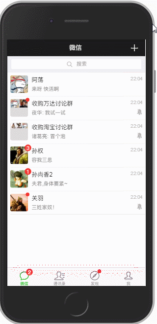

# 一款基于Vue2.0高仿微信App的单页应用

## 概述

本项目是使用Vue.js2.0框架，搭配样式库[WeUI](https://weui.io/)，模仿微信app的交互，做到以假乱真的效果。

项目地址 `https://github.com/zhaohaodang/vue-WeChat`

## 手机预览

首选红色，加载较快


蓝色为备用地址，加载较慢


测试机为iPhone 6s，在微信内置浏览器以及Safari、Chrome浏览器中运行良好。

如果你觉得不错想给作者**点个赞**，可以给项目增加一个 Star ★，项目会被收录在 Your stars 中，方便日后查看。

如果你想时时**关注**项目动态，可 Watch ⊙ 此项目，github平台会及时通知你项目的动态。

## 本地预览

1.克隆代码到本地

``` 
git clone https://github.com/zhaohaodang/vue-WeChat.git
```

2.进入项目路径

``` 
cd vue-WeChat
```

3.安装依赖（安装较慢的话建议使用淘宝镜像）

``` 
npm install
```

4.启动项目

``` 
npm run serve
```

## 桌面预览

加载较快  [https://zhaohd.gitee.io/vue2-wechat](https://zhaohd.gitee.io/vue2-wechat)

备选 加载较慢 [https://vue2-wechat.github.io](https://vue2-wechat.github.io)

桌面端浏览时，建议打开***开发者工具*** `F12` ，模拟手机预览 `Ctrl+Shift+M` (Chrome)

## 动图预览

**微信列表的滑动交互**


**搜素组件的动画效果**



**进入对话框**


**对话框信息**


**首页Tab切换**


## 技术相关

* [vue-WeChat Wiki](https://github.com/zhaohaodang/vue-WeChat/wiki) 中记录了开发此项目需要的知识储备、开发思路、开发利器等。
* 每个主要的.vue和.js文件都有详细的**注释**提示，建议将仓库 `clone` 到本地，查看源码。 

示例1( store.js 注解)


示例2( App.vue 注解)


## 问题反馈

移步[Issues](https://github.com/zhaohaodang/vue-WeChat/issues)，欢迎提出问题和建议。

## 其他

* [vue-see](https://github.com/zhaohaodang/vue-see) 适用于 Vue.2x 的图片预览插件