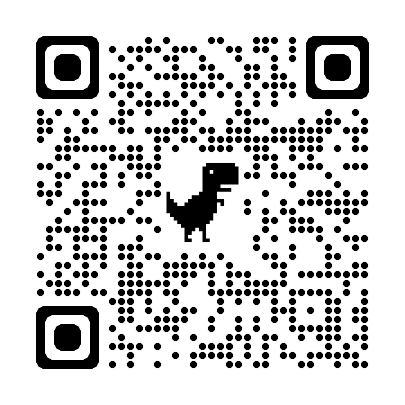
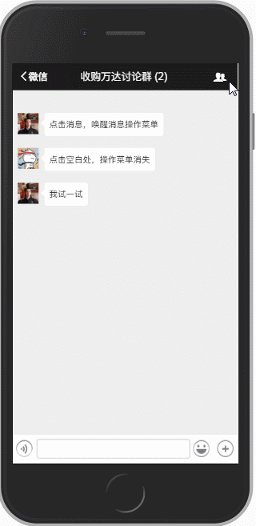

# 基于 Vue.js2.0 高仿微信 App 的单页应用

## 概述

本项目是使用 Vue.js2.0 框架，搭配样式库[WeUI](https://weui.io/)，模仿微信 app 的样式和交互。

项目地址 `https://github.com/zhaohaodang/vue-WeChat`

## 手机预览

首选红色，加载较快



如果你觉得不错想给作者**点个赞**，可以给项目增加一个 Star ★，项目会被收录在 Your stars 中，方便日后查看。

如果你想时时**关注**项目动态，可 Watch ⊙ 此项目，github 平台会及时通知你项目的动态。

## 启动项目

1.克隆代码到本地

```
git clone https://github.com/zhaohaodang/vue-WeChat.git
```

2.进入项目路径

```
cd vue-WeChat
```

3.安装依赖（安装较慢的话建议使用淘宝镜像）

```
npm install
```

4.启动项目

```
npm run dev
```

## 动图预览

**微信列表的滑动交互**


**搜素组件的动画效果**


**进入对话框**


**对话框信息**



**首页 Tab 切换**


## 技术相关

- [vue-WeChat Wiki](https://github.com/zhaohaodang/vue-WeChat/wiki) 中记录了开发此项目需要的知识储备、开发思路、开发利器等。
- 每个主要的.vue 和.js 文件都有详细的**注释**提示，建议将仓库 `clone` 到本地，查看源码。

## 问题反馈

移步[Issues](https://github.com/zhaohaodang/vue-WeChat/issues)，欢迎提出问题和建议。

## 推荐

- [vue-see](https://github.com/zhaohaodang/vue-see) 适用于 Vue.2x 的图片预览插件
